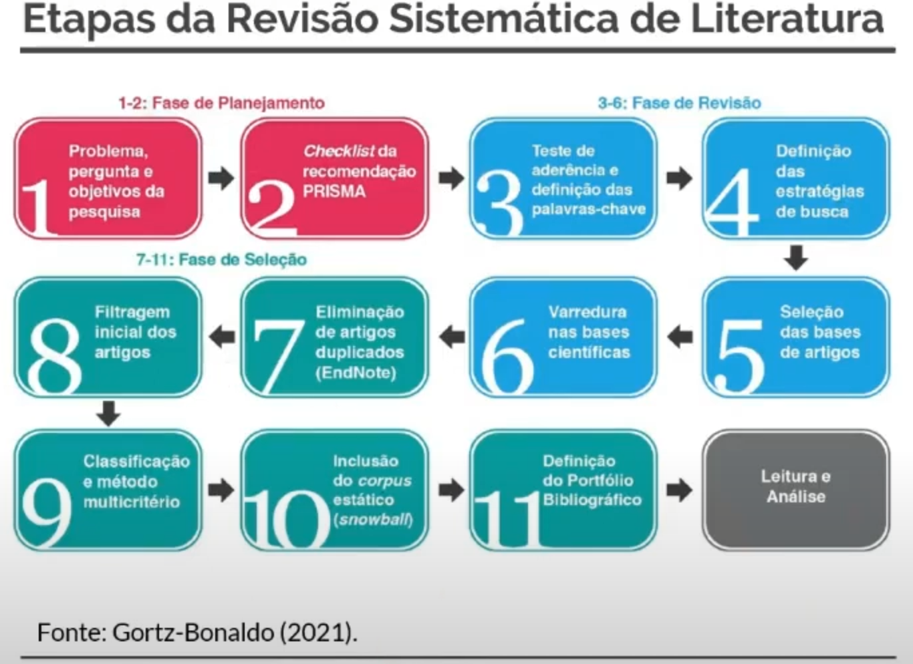

# Revisão Sistemática de Literatura voltada para Pesquisas Qualitativas

RSL [Vídeo do Explicativo do método RSL](https://www.youtube.com/watch?v=zkaiUmUoT1Q&t=234s).

## Fases ou Etapas

1. *Planejamento:* Fluxograma e recomendação PRISMA
    1. Problema, pergunta e objetivos da pesquisa
    2. Checklist da recomendação PRISMA
2. *Levantamento bibliométrico:* Testes de aderência, definição de estratégias e varredura nas bases
    3. Teste de aderência e definição das palavras-chave
    4. Definição das estratégias de busca
    5. Seleção das bases de artigos
    6. Varredura nas bases científicas
3. *Seleção do corpus (portfolio bibliográfico):* filtro pelo método multicritério (análise sistemática) e inclusão de referências de base pelo método Snowball
    7. Eleminação de artigos duplicados (EndNote)
    8. Filtragem inial dos artigos
    9. Classificação e método multicritério
    10. Inclusão do corpus estático (snowball)
    11. Definição do Portfólio Bibliográfico
4. Leitura e Análise

## Definição

- Processo metodológico de pesquisa bibliográfica para identificar toda pesquisa relevante para o objeto de estudo (publicações recentes, tendências de pesquisa, conceitos);
- Método científico para desenvolver buscas e analisar artigos de uma determinada áera da ciência, indicado pela preocupação com o rigor, por ser metódico, transparente e permitir rastreabilidade (RAMOS; FARIA; FARIA, 2014);
- Reprodutível e consistente: Protocolo de pesquisa e critérios bem-definidos.

## Resultado final

- Conjunto de referências bibliográficas que compõem a Fundamentação Teórica (e fundamentam a análise dos dados);
- Portfólio bibliográfico final composto por:
    1. *Corpus dinâmico*: Últimos 5 anos (estado da arte) aprox. 75% do corpus total
    2. *Corpus estático*: anterior aos últeimos 5 anos (autores de base) aprox. 25% de corpus total